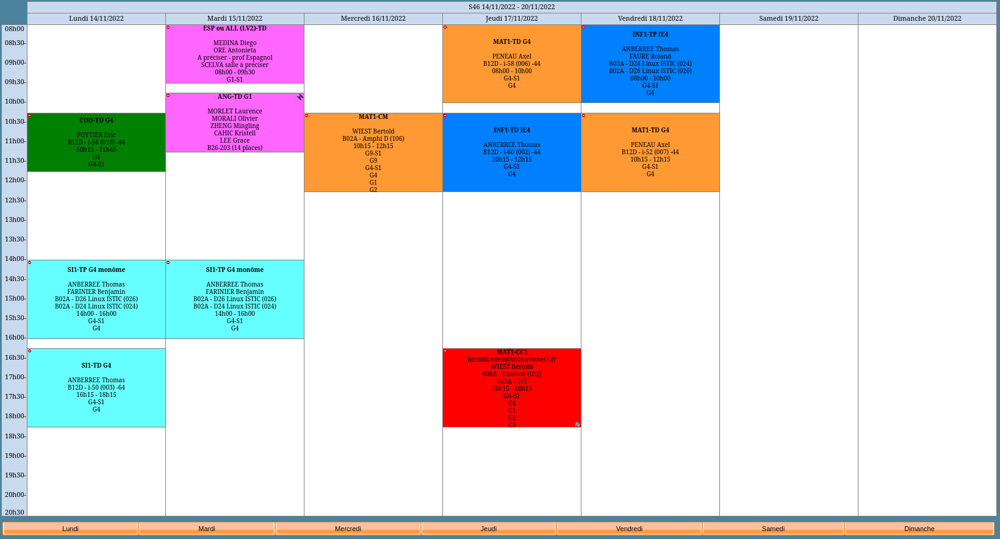
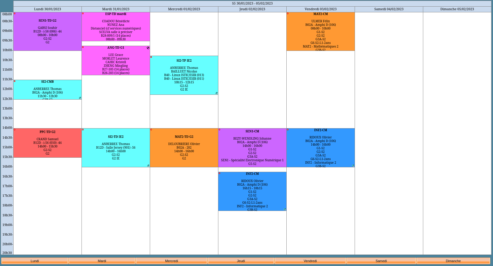

# Présentation licence informatique

---

# Qui suis-je ?

 - Lucas, étudiant en 1ère année de Master Cybersécurité à Rennes
 - Ancien lycéen de Benjamin Franklin
 - L1/L2 Informatique à L'Université de Bretagne Sud (à Vannes)
 - L3 à L'Université de Rennes 1 (Université de Rennes depuis janvier 2023)

---

# Contenu des cours

 - Contenu de la L1/L2 très proche de la spé NSI
 - La spé va donner de gros prérequis
 - Certains points sont plus appronfondis
   - mais risque de s'ennuyer parfois

---

# Organisation des cours

 - Fonctionne avec le format CM/TD/TP (pas universel, certaines matières n'ont pas de TP)
     - CM => cours théorique
     - TD => exercices sur la théorie 
     - TP => exercices pratiques
 
 - TP diffèrent selon les matières, soit un projet soir un TP par thème du cours

---

# Volume horaire

 - Rennes/Vannes: ~20h/semaines
    - Rennes: Blocs de 2h (sauf exceptions)
    - Vannes: Blocs de 1h30 (depuis septembre 2020)
 - Rennes: L1 => 20% CM, 30% TP et 50% TD
 - Rennes: vous pouvez les consulter les emplois du temps sur l'ENT (https://ent.univ-rennes1.fr)

---

# Exemples d'emploi du temps

---

### exemple 1

---

### exemple 2

---

# Différences Rennes/Vannes

---

## Rennes
 - Licence très générale
 - Licence Info/Elec: électronique en L1/L2
 - Campus plus vivant (beaucoup d'asso, 1 pour l'ISTIC, 1 de robotique, ...)
 - promo ~200 personnes
 - TP en binôme

---

## Vannes
 - Tronc commun maths/info/stats (stats sont complètement optionnelles)
 - Choix de cours dès la L1 (plutôt orienté maths, ou info, ou stats)
 - Options physique en L1 (les 2 semestres), ou économie (pour les hérétiques)
 - promo ~60 personnes (maths/info/stats confondus)
 - TP se font seuls (en grande majorité)

---

# Quelques warnings
 - Maths jusqu'en L2 (Vannes et Rennes)
 - Beaucoup de matières théoriques 
 - Certaines matières n'ont pas de TP (les plus théoriques n'ont que TD)
 - Très loin d'être tout le temps en train de programmer (cf. proportions cours)
 - Essayez d'en faire le maximum possible (quit à avoir pas mal d'acquis, autant les exploiter au mieux)
 - Autonomie complète pour travailler, personne va vérifier vos devoirs

---

# Cependant
 - Pas besoin d'être bon en maths pour avoir sa licence (pas une raison pour abandonner, surtout si on s'oriente vers la cyber)
 - Encadrement des L1 (à Vannes et Rennes) par des enseignant de la licence (rôle de tuteurs), pour vous accompagner
 
---

# Charge de travail 

 - Mon ressenti: sans avoir fait NSI, j'ai jamais été contraint de me démener pour avoir de bons résultats
 - L1: ceux qui ont fait NSI s'en sortent très bien, et pareil pour ceux qui n'ont pas fait.

---

# Informations utiles

## Journées portes ouvertes

  - Vannes: 04 février
  - Rennes: 04 février

## Liens utiles

###### Sites avec contenu des cours :
  
  - UBS: https://www-informatique.univ-ubs.fr/licence-info/index.shtml
  - ISTIC: https://formations.univ-rennes.fr/licence-mention-informatique-parcours-informatique

---

# Mes coordonnées

 - Mail: lucasroquet@pm.me
 - Discord: Hubert#1449 

###### Diapo disponible ici : https://github.com/lucasrqt/presentation-nsi

--- 

# Questions ?